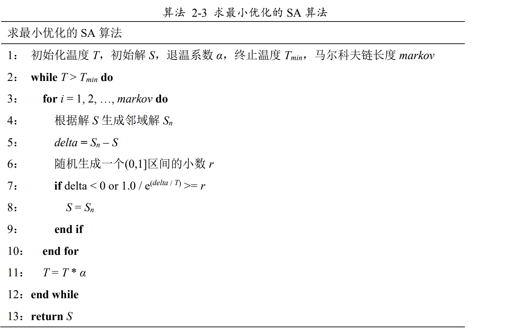
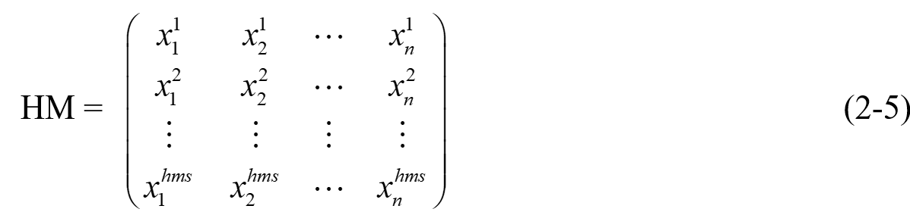
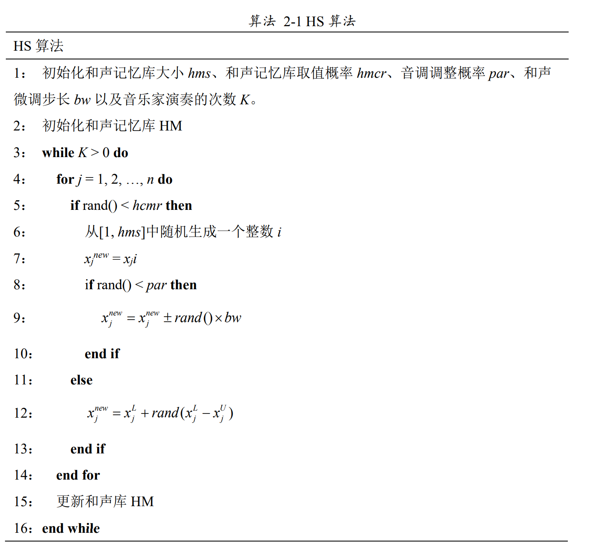
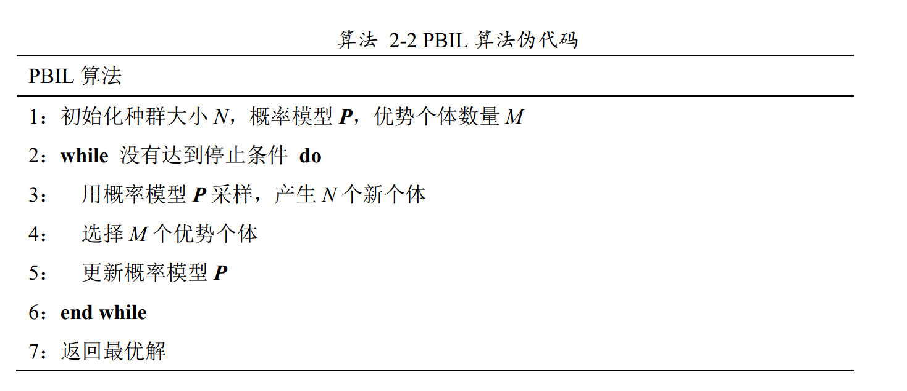

github 常用编辑公式： https://blog.csdn.net/lihaoweicsdn/article/details/83895143
# 差分进化算法
差分进化算法（Differential Evolution, DE）是一种基于群体的优化算法，它通过模拟生物进化中的交叉（或称为配对）、变异和自然选择等机制来迭代地产生新的种群。DE 算法的一般流程如下：

1. **初始化**：随机生成一个初始种群，种群中的每个个体代表了解空间中的一个候选解。每个个体的基因表示问题的参数集合。

2. **变异操作**：对于种群中的每个个体，随机选择若干个其他个体，计算它们之间的差分，并用这个差分与另一个个体相加，得到一个变异个体。变异步骤通常涉及一个缩放因子（F），用于控制差分的尺度。

3. **交叉操作**：将变异个体与原个体进行交叉，以产生子代个体。交叉通常基于交叉率（CR），决定是否用变异个体的一个或多个参数替换原个体的对应参数。

4. **选择操作**：在原个体和新生成的子代个体之间进行选择，通常基于适应度评估。适应度更高的个体有更大的机会被保留到下一代。

5. **更新种群**：根据选择操作的结果，更新种群，形成新的一代。

6. **终止条件判断**：如果满足终止条件（如达到最大迭代次数、解的质量满足预设阈值等），则停止算法并输出当前最优解；否则，返回步骤2继续迭代。

DE 算法的数学表达通常如下：

- 变异：生成一个变异个体 $U_i = X_{r1} + F \cdot (X_{r2} - X_{r3})$，其中 $X_{r1}$ 、 $X_{r2}$ 、 $X_{r3}$  是种群中随机选择的三个不同个体， $F$  是缩放因子。

- 交叉：生成一个子代个体 $V_i$，对于个体的每个参数 $d$，如果 $rand(0, 1) < CR$ 或 $d = d_{rand}$（其中 $d_{rand}$ 是一个随机选择的维度），则 $v_{i,d} = u_{i,d}$，否则 $v_{i,d} = x_{i,d}$。

- 选择：如果 $f(V_i) < f(X_i)$，则 $X_i$ 被 $V_i$ 替换，其中 $f$ 是适应度函数。

DE 算法因其简单、鲁棒性强和易于实现而被广泛应用于各种优化问题，尤其是在连续空间的全局优化问题中。

# 遗传算法
遗传算法（Genetic Algorithm, GA）是一种启发式搜索算法，它模仿了自然选择的过程，通过选择、交叉（或称为配对）、变异等操作在候选解的种群中进行搜索，以找到最优解或近似最优解。以下是遗传算法的基本流程：

1. **初始化**：随机生成初始种群。种群由多个个体组成，每个个体都是问题解空间中的一个候选解。

2. **适应度评估**：计算每个个体的适应度值。适应度函数是衡量个体解质量的指标，它根据问题的目标函数来定义。

3. **选择**：根据个体的适应度值选择个体进行繁殖。常见的选择方法包括轮盘赌选择、锦标赛选择和排名选择等。

4. **交叉**：选中的个体按照交叉概率进行配对，并通过交叉操作产生后代。交叉操作可以是单点交叉、多点交叉或均匀交叉等。

5. **变异**：对新生成的后代个体以一定的变异概率进行变异操作，以引入新的遗传信息。变异操作通常涉及随机改变个体的某些基因。

6. **新一代种群的形成**：根据特定的策略（如精英策略、替换策略等）从当前种群和新生成的后代中选择个体形成新一代种群。

7. **终止条件判断**：如果满足终止条件（如达到最大迭代次数、解的质量满足预设阈值、适应度不再显著提高等），则停止算法，并输出当前最优个体作为问题的解。

8. **迭代**：如果不满足终止条件，返回步骤2继续进行适应度评估，直到找到满意的解。

遗传算法的数学表达通常如下：

- 选择：根据 $f(X_i)$（适应度函数）和选择概率 $P_i$ 选择个体 $X_i$。

- 交叉：对于选中的两个个体 $X_a$ 和 $X_b$，在交叉点 $r_l$ 进行交叉，生成新的个体 $X_{off1}$ 和 $X_{off2}$：

$$X_{off1}(i) = \begin{cases}
		X_a(i) & \text{if } i \leq r_l\\
		X_b(i) & \text{if } i > r_l\\
		\end{cases}$$

$$X_{off1}(i) = \begin{cases}
		X_b(i) & \text{if } i \leq r_l\\
		X_a(i) & \text{if } i > r_l\\
		\end{cases}$$

- 变异：对于新个体 $X_{new}$ 的每个基因 $X_{new}(i)$，以变异概率 $p_m$ 决定是否进行变异：

$$X_{new}'(i) = \begin{cases}
	 X_{new}(i) + \epsilon & \text{with probability } p_m\\
	 X_{new}(i) & \text{otherwise}\\
	 \end{cases}$$

其中， $\epsilon$ 是一个随机扰动项。

遗传算法因其全局搜索能力强、适应性广、易于并行化等优点，在许多复杂的优化问题中得到了应用。然而，算法的表现很大程度上依赖于适应度函数的设计、选择、交叉和变异操作的具体实现，以及种群大小、交叉率、变异率等参数的设定。

# 模拟退火算法

# 和声搜素算法
HS算法是一种新兴的智能优化算法，由Geem[24]等人在2001年提出。该算法模仿音乐即兴过程，即音乐家即兴演奏他们的乐器，通过调整乐器的音调，来寻找完美的和声状态。自和声搜索算法提出以来，该算法在各个领域都得到了广泛应用。

在HS中，个体的解用长度为n的向量x表示，和声库HM有hms个向量组成，如公式(2-5)所示。HS算法首先随机初始化和声记忆库HM，然后通过音乐家的记忆对曲谱x的音调进行修正或者随机创作来产生新的曲谱(候选解)，最后将新曲谱(候选解)与记忆库HM中最差的曲谱(最差解)进行比较，更新记忆库HM，直至找到最完美的和声(最优解)，HS伪代码如算法 2-1所示。

在算法 2-1中，第2行伪代码表示对和声记忆库进行初始化，和声向量初始化公式如式(2-6)所示：

$$x_i = x^L_i + rand * (x^U_i - x^L_i)$$ 	(2-6)

其中 $x^U_i$ 表示第i维解空间的上界， $x^i_L$ 表示第i维解空间的下界。算法第5行和第8行中的rand()表示随机生成一个[0, 1)范围的数，第9行表示对从和声记忆库中选出的曲调进行微调，算法第12行表示用随机创作的方式来生成新的曲调。HS算法通过不断调整和声记忆库中的曲调，使函数值随着迭代次数的增加不断收敛，最终找到最优解。

# 群体增量学习算法
PBIL算法是美国卡内基梅隆大学Baluja[33]提出的基于统计学习理论的群体进化算法。作为分布式估计算法的分支，PBIL为只使用一个变量构建概率模型的单变量算法，通过统计学习的方式建立解空间个体分布的概率模型，然后用概率模型进行采样产生新的群体，从而实现群体的进化。PBIL算法中主要是通过概率模型的更新来指导种群的进化，可以说，概率模型是PBIL算法中最关键的部分。

在PBIL算法中，种群大小用N表示，个体表示问题的一个解，解的编码一般用二进制表示，编码的长度为L，即问题的规模；M表示优势个体的数量，α表示算法的学习速率。概率向量 $P=(p_1, …, p_i, …, p_n)$ ，用来表示解空间的概率模型，其中p_i表示第i个等位基因的取值为1的概率； PBIL的算法伪代码如算法 2 2所示。

在算法 2-2中最优个体数目M小于种群的个体数N。概率模型的更新通过每代种群中适应度最高的M个个体进行修正，并且通过该模型指导产生下一代种群的新个体。如此迭代直至达到停止条件，算法最终朝向局部最优解或全局最优解逼近。概率向量更新公式如式(2-7)所示: 
$$p_i = (1 - \alpha) * P_i + \alpha * \frac{1}{M} * \sum_{k = 0}^{M} x^k_i$$	 	(2-7)

其中xk表示第k个优质解。
PBIL结合了遗传算法和竞争学习机制的优点，具有较强的全局搜索能力和较快的收敛速度，是一种简单便捷的进化优化算法。随着对PBIL算法的不断研究，不少学者针对求解连续优化问题的PBIL算法和求解离散优化问题的PBIL算法进行了研究。

